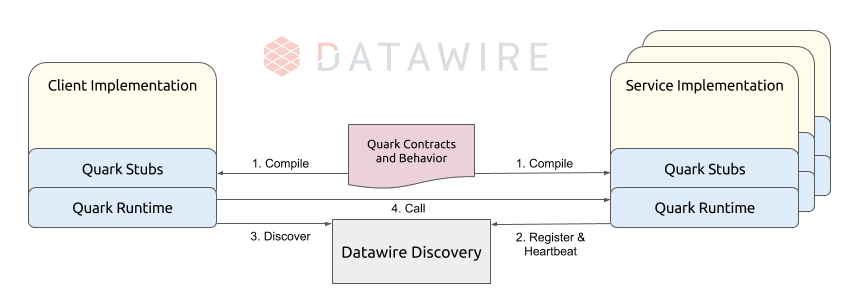

# Datawire Connect

**Datawire Connect** helps you build and run resilient microservices. It allows you to
express the interfaces between your services, define how they should behave when
they interact, and helps them reliably discover and reach other services at runtime.

A core part of Datawire Connect is **Quark**, a language that is used to define the
interfaces to your microservices and, more importantly, influence their runtime
behaviors. With Quark, you can specify much more than just the parameters of the
methods you create. You can also define how clients of that service should behave
if the service is running slowly, or add circuit breaking, or cache existing
response values to improve performance. There's no practical limit to the
sophistication of the behaviors you could add to your microservices.

Datawire Connect also includes client-side load balancing through **Datawire Connect Proxy**.
Client-side load balancers are far more scalable and less prone to becoming bottlenecks
than traditional centralized load balancers.

Discovery is achieved in Datawire Connect through **Datawire Hub**. This technology
offers your services a reliable and resilient way to register themselves so that
other services can find them.

### Illustration ###



## Getting Started in 5 Minutes

Datawire Connect is super easy to install and use.

#### Installation
```
pip install datawire-quark
```
#### Running an Example

The first demo to try is the `HelloRPC` demo. We have a microservice running in
the cloud that you can call using the `HelloRPC` client example:

```
cd datawire-quark/examples/HelloRPC
quark --python package hello.q
pip install hello/py/dist/hello-0.1.0-py2-none-any.whl
python pyclient.py
```
You should see the following:

```
Hello Python from Datawire Connect!
```

Follow the instructions in the HelloRPC `README` to take the next steps by
learning how to run your own local server, how to call your new local server
instead, and change the client to be more resilient.

## Features of Datawire Connect

* Native support for building resilient microservices in Python, JavaScript,
and Java (Ruby and Go support coming soon)
* Automatic microservice registration with the Datawire Hub discovery service
* Custom serialization support
* Support for HTTP/S, JSON, XML, Web Sockets...you name it
* Turing Complete language (Quark) that combines an IDL with a DSL, making it
very powerful for defining resilient service behaviors

## Roadmap

Lots of exciting features are currently being developed for Datawire Connect,
including:

* Support for Ruby and Go
* Cloud-based version of Datawire Hub
* Per-request timeouts and per-service timeouts (aka, circuit breaking)
* Intelligent Load balancing

For more information, read our detailed Roadmap.

# Getting Involved

Datawire Connect is open source! Please feel free to raise issues as needed,
or talk to the experts on this mailing list. If you'd like to make an enhancement
or fix, please submit a Pull Request with your changes.
